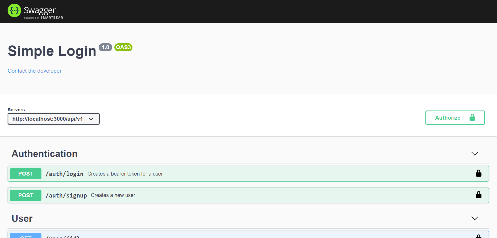

# NodeJsTsStarter

This project is a starter for a node Js rest API. It includes authentication(login/signup) routes and one Entity CRUD. 

## Description
The main tools used are:
- Typescript / javascript transpiler
- Express / web application framework
- Mongodb / driver to handle mongo databases
- swagger-ui-express / API Documentation generator
- Docker / deployment tool
- i18next / internationalization framework
- passport / authentication middleware
- Eslint / Linter 
- prettier / code formatter
- vscode / IDE

## Project Structure

```
+---.vscode
+---build
+---resources
|   +---images
|   \---locales
|       +---en
|       \---es
\---src
    +---@types
    |   +---express
    |   \---Primitives
    +---controllers
    |   +---Dto
    |   \---responses
    +---lib
    +---middlewares
    +---model
    +---routes
    \---services
```

## Usage

First clone the remote repositorie to your desktop

```bash
git clone https://github.com/Wilman2612/NodeJsTsStarter awesomeProject
```
Then navigate to your project folder and install npm packages and start the docker containers. Make sure docker is set up and runnig.

```bash
cd awesomeProject
npm i
docker-compose up
```
If everything goes fine the server is running, to test it navigate to http://localhost:3000/api-docs/



## License

[MIT](https://choosealicense.com/licenses/mit/)
